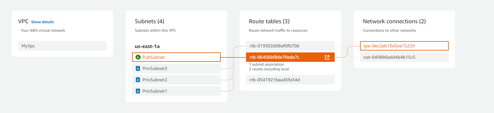
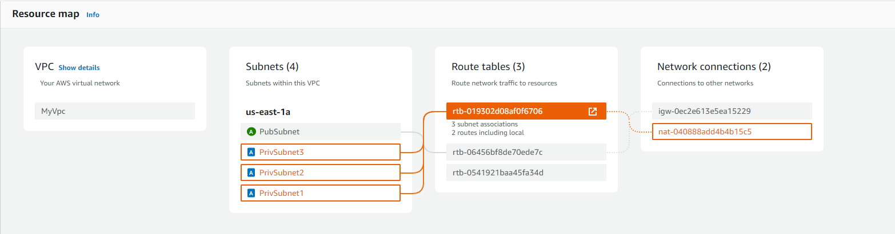

# Welcome to your CDK Python project!

This is a blank project for CDK development with Python.

The `cdk.json` file tells the CDK Toolkit how to execute your app.

This project is set up like a standard Python project.  The initialization
process also creates a virtualenv within this project, stored under the `.venv`
directory.  To create the virtualenv it assumes that there is a `python3`
(or `python` for Windows) executable in your path with access to the `venv`
package. If for any reason the automatic creation of the virtualenv fails,
you can create the virtualenv manually.

To manually create a virtualenv on MacOS and Linux:

```
$ python -m venv .venv
```

After the init process completes and the virtualenv is created, you can use the following
step to activate your virtualenv.

```
$ source .venv/bin/activate
```

If you are a Windows platform, you would activate the virtualenv like this:

```
% .venv\Scripts\activate.bat
```

Once the virtualenv is activated, you can install the required dependencies.

```
$ pip install -r requirements.txt
```

At this point you can now synthesize the CloudFormation template for this code.

```
$ cdk synth
```

To add additional dependencies, for example other CDK libraries, just add
them to your `setup.py` file and rerun the `pip install -r requirements.txt`
command.

## Useful commands

 * `cdk ls`          list all stacks in the app
 * `cdk synth`       emits the synthesized CloudFormation template
 * `cdk deploy`      deploy this stack to your default AWS account/region
 * `cdk diff`        compare deployed stack with current state
 * `cdk docs`        open CDK documentation

Enjoy!

# AWS CDK VPC Stack

## Overview

This project defines an AWS CDK stack that sets up a VPC with one public subnet and two private subnets. It includes necessary resources such as an Internet Gateway, NAT Gateway, and route tables for proper network routing.

## Resources

- **VPC**: A Virtual Private Cloud with CIDR block `15.0.0.0/16`.
- **Public Subnet**: A public subnet with CIDR block `15.0.1.0/24`.
- **Private Subnets**: Two private subnets with CIDR blocks `15.0.2.0/24`, `15.0.3.0/24` and `15.0.4.0/24`.
- **Internet Gateway**: Attached to the VPC for outbound internet access.
- **NAT Gateway**: Allows private subnets to access the internet.
- **Route Tables**: Configured for public and private subnets to manage routing.

## Screenshots

### VPC Resource Map

This screenshot shows the overall view of the VPC, including public and private subnets.


### Private and Public Subnets Details

This screenshot provides a detailed view of the public and private subnets, including their associated route tables and NAT Gateway.





## Deployment

To deploy this stack using AWS CDK, follow these steps:

1. **Install AWS CDK**: Make sure you have AWS CDK installed. If not, you can install it using npm:
    ```bash
    npm install -g aws-cdk
    ```

2. **Bootstrap Your Environment**: If this is your first CDK deployment, bootstrap your environment:
    ```bash
    cdk bootstrap
    ```

3. **Deploy the Stack**:
    ```bash
    cdk deploy
    ```

4. **Verify the Deployment**: Check the AWS Management Console to verify the creation of the VPC and its associated resources.

## Contributing

If you would like to contribute to this project, please fork the repository and submit a pull request with your changes.

## License

This project is licensed under the MIT License. See the [LICENSE](LICENSE) file for details.

